# BillBuddy, Architecture and Data Flow

How the app works end-to-end: where data comes from, how it flows through the system, and where it's stored.

---

## Overview

BillBuddy is a client-side Next.js app. There is **no backend, no database, no API calls**. All data lives in the browser's `localStorage`. The server only serves the initial HTML/JS, after that everything runs in the browser.

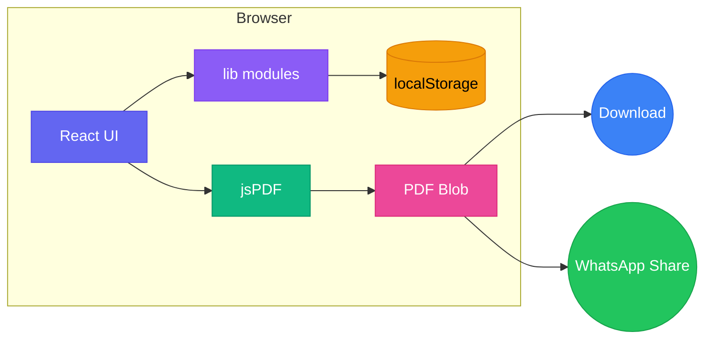

---

## System Architecture

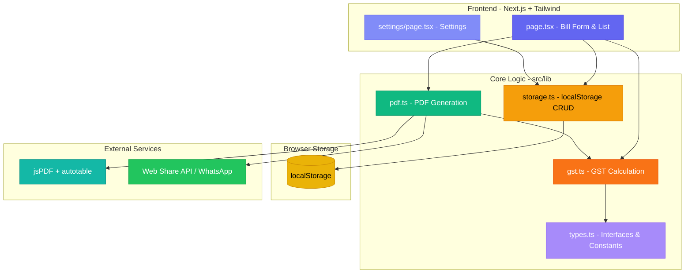

---

## Data Models

Defined in `src/lib/types.ts`:

### BillItem

A single line item on a bill.

| Field | Type | Description |
|-------|------|-------------|
| `name` | string | e.g. "Rice Bag" |
| `hsn` | string | HSN code, e.g. "1006" |
| `quantity` | number | e.g. 2 |
| `rate` | number | Price per unit in ₹, e.g. 450 |
| `gstRate` | number | GST percentage: 0, 5, 12, 18, 28 |

### Bill

A complete invoice record.

| Field | Type | Description |
|-------|------|-------------|
| `id` | string | Unique ID (timestamp + random) |
| `invoiceNumber` | string | Sequential number, e.g. "INV-001" |
| `date` | string | ISO datetime of creation |
| `customerName` | string | Buyer name |
| `customerPhone` | string | Buyer phone |
| `gstType` | "intra" \| "inter" | CGST+SGST or IGST |
| `items` | BillItem[] | 1–5 items |
| `totalBeforeTax` | number | Sum of (qty × rate) |
| `totalTax` | number | Total GST amount |
| `grandTotal` | number | totalBeforeTax + totalTax |
| `dueDate` | string | Optional due date (ISO), empty if not set |
| `notes` | string | Optional notes/memo, empty if not set |

### Settings

Shop configuration, persisted across sessions.

| Field | Type | Description |
|-------|------|-------------|
| `shopName` | string | Business name |
| `shopAddress` | string | Full address |
| `shopGSTIN` | string | 15-character GSTIN |
| `logo` | string | Base64 data URL of uploaded image |
| `defaultGSTRate` | number | Pre-fill rate for new items |

---

## Storage Layer

File: `src/lib/storage.ts`

All persistence uses **localStorage** with three keys:

| Key | Contents | Format |
|-----|----------|--------|
| `billbuddy_bills` | Array of Bill objects | JSON |
| `billbuddy_settings` | Settings object | JSON |
| `billbuddy_invoice_counter` | Invoice counter (number) | Number |

### Functions

| Function | What it does |
|----------|-------------|
| `getBills()` | Reads all bills, returns `[]` on error or SSR |
| `saveBill(bill)` | Prepends bill (newest first), writes back |
| `deleteBill(id)` | Filters out by ID, writes back |
| `getSettings()` | Reads settings, merges with defaults |
| `saveSettings(settings)` | Writes settings object |
| `getNextInvoiceNumber()` | Returns next invoice number (INV-XXX format) |
| `incrementInvoiceCounter()` | Increments the stored counter |

### SSR Safety

All read functions check `typeof window === "undefined"` before accessing localStorage. On the server (during SSR), they return safe defaults.

### Storage Limits

localStorage has a ~5MB limit per origin. The logo is the biggest consumer, typically 20-100KB as base64.

---

## GST Calculation

File: `src/lib/gst.ts`

### Intra-State (CGST + SGST)

When shop and customer are in the **same state**:

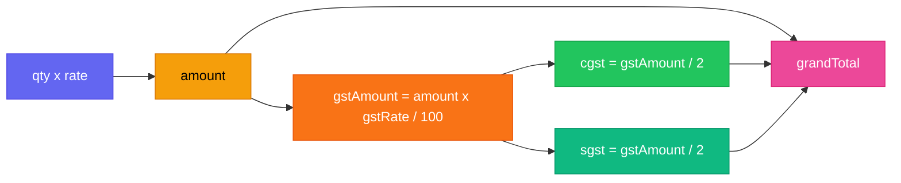

**Example:** 2 �, ₹450 rice bags at 18% GST
- Amount: ₹900
- CGST (9%): ₹81
- SGST (9%): ₹81
- **Total: ₹1,062**

### Inter-State (IGST)

When shop and customer are in **different states**:

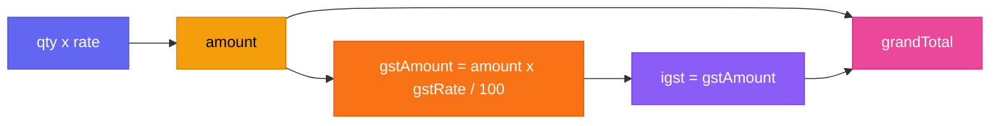

**Same example:** IGST (18%) = ₹162, **Total: ₹1,062**

### Rounding

All amounts rounded to 2 decimal places: `Math.round(x * 100) / 100`

---

## Complete Data Flow

### 1. App Initialization

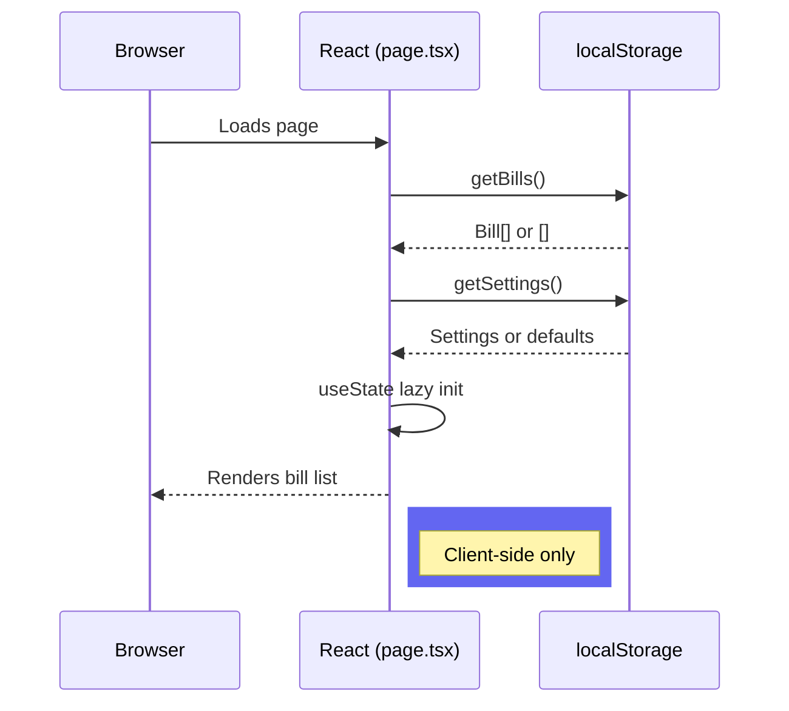

### 2. Creating a Bill

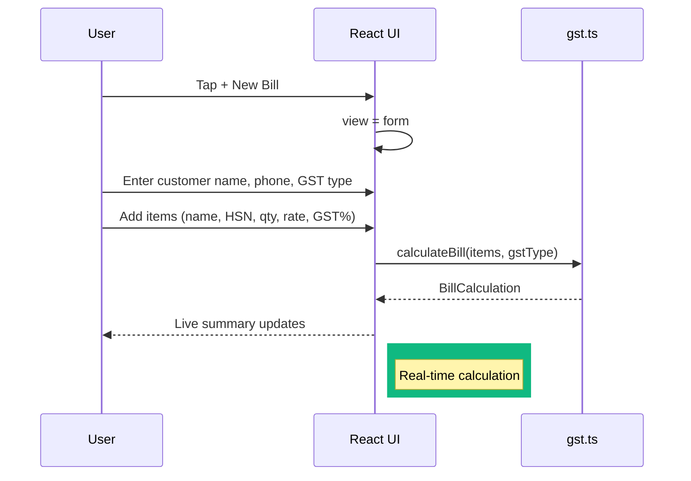

### 3. Saving a Bill

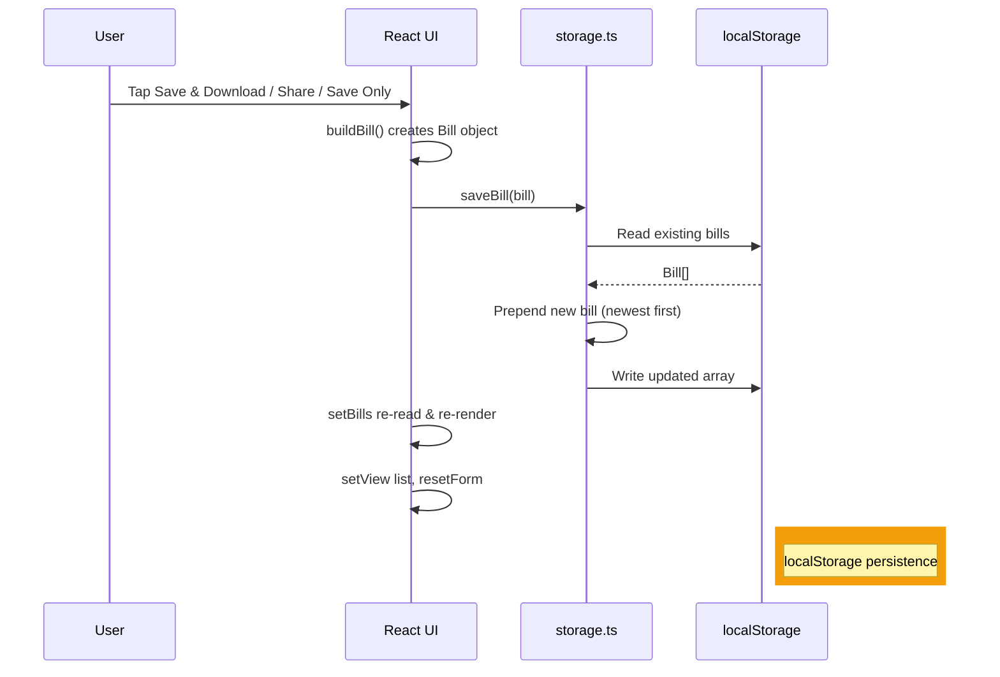

### 4. PDF Generation

```mermaid
flowchart TD
    A["downloadPDF / sharePDF"] --> B["generateBillPDF"]
    B --> C["Create jsPDF A4 document"]
    C --> D["Page 1: TAX INVOICE"]
    C --> E["Page 2: TERMS AND CONDITIONS"]

    D --> D1["Header: Logo + Shop + GSTIN"]
    D --> D2["TAX INVOICE title bar"]
    D --> D3["Invoice No, Date, GST Type"]
    D --> D4["Buyer: Name, Phone"]
    D --> D5["Items Table via autotable"]
    D --> D6["Tax Summary: CGST/SGST or IGST"]
    D --> D7["Grand Total"]
    D --> D8["Amount in Words"]
    D --> D9["Reverse Charge Declaration"]
    D --> D10["Authorised Signatory"]

    E --> E1["10 Standard GST Terms"]
    E --> E2["Bank Details"]
    E --> E3["Thank You + Footer"]

    style A fill:#6366f1,color:#fff,stroke:#4f46e5
    style B fill:#8b5cf6,color:#fff,stroke:#7c3aed
    style C fill:#a78bfa,color:#fff,stroke:#8b5cf6
    style D fill:#10b981,color:#fff,stroke:#059669
    style E fill:#f59e0b,color:#000,stroke:#d97706
    style D1 fill:#34d399,color:#000,stroke:#10b981
    style D2 fill:#059669,color:#fff,stroke:#047857
    style D3 fill:#6ee7b7,color:#000,stroke:#34d399
    style D4 fill:#6ee7b7,color:#000,stroke:#34d399
    style D5 fill:#a7f3d0,color:#000,stroke:#6ee7b7
    style D6 fill:#d1fae5,color:#000,stroke:#a7f3d0
    style D7 fill:#059669,color:#fff,stroke:#047857
    style D8 fill:#d1fae5,color:#000,stroke:#a7f3d0
    style D9 fill:#d1fae5,color:#000,stroke:#a7f3d0
    style D10 fill:#059669,color:#fff,stroke:#047857
    style E1 fill:#fbbf24,color:#000,stroke:#f59e0b
    style E2 fill:#fcd34d,color:#000,stroke:#fbbf24
    style E3 fill:#fde68a,color:#000,stroke:#fcd34d
```

### 5. Sharing (Download vs WhatsApp)

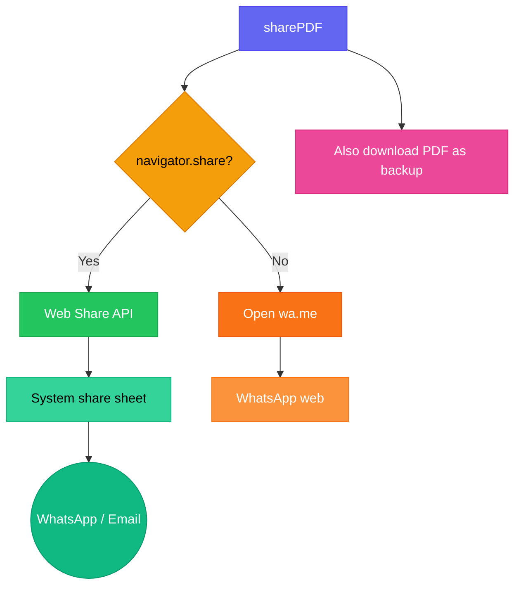

### 6. Deleting a Bill

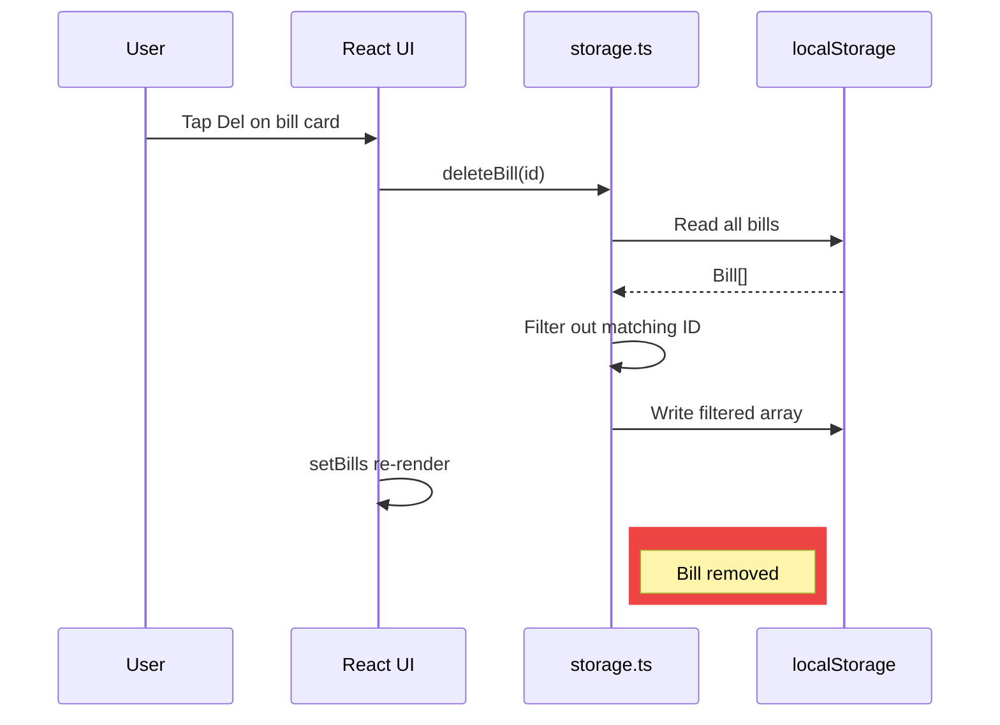

### 7. Settings Flow

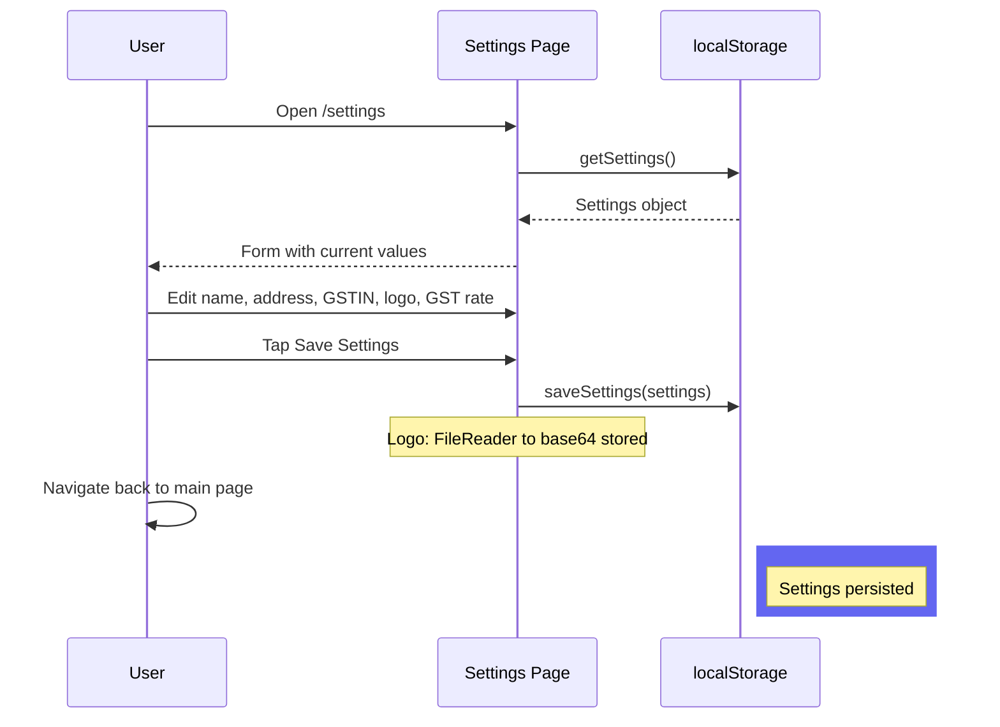

---

## PDF Layout (2 Pages)

### Page 1: Tax Invoice

```
┌─────────────────────────────────────────────┐
│  [LOGO]  Shop Name                          │
│          Address                             │
│          GSTIN: 27AAAAA0000A1Z5             │
├─────────────────────────────────────────────┤
│           TAX INVOICE                        │
├─────────────────────┬───────────────────────┤
│ Invoice No: xxxxx   │ Bill To:              │
│ Date: 29-Jul-2026   │ Customer Name         │
│ GST Type: Intra     │ Ph: 98765xxxxx        │
├────┬────┬─────┬─────┼─────┬───────┬────────┤
│ #  │Item│ HSN │ Qty │Rate│ Amount│ CGST  │ SGST  │ Total  │
├────┼────┼─────┼─────┼─────┼───────┼────────┤
│ 1  │... │ ... │  2  │450  │ 900   │ 81    │ 81    │ 1062   │
├────┴────┴─────┴─────┼─────┼───────┼────────┤
│                     │Subtotal│ 900  │        │
│                     │CGST    │ 81   │        │
│                     │SGST    │ 81   │        │
│                     │TOTAL   │1062  │        │
├─────────────────────┴───────┴────────┤
│ Amount in Words: Rupees One Thousand  │
│ Sixty Two Only                        │
│ Reverse Charge: No                     │
│                                        │
│ For Shop Name                         │
│ _________________                     │
│ Authorised Signatory                  │
└────────────────────────────────────────┘
```

### Page 2: Terms and Conditions

```
┌────────────────────────────────────────┐
│         TERMS & CONDITIONS              │
├────────────────────────────────────────┤
│ 1. Payment due within 30 days.          │
│ 2. Interest at 18% p.a. on overdue.    │
│ 3. Goods once sold will not be returned.│
│ 4. Disputes subject to local jurisdiction│
│ 5. Computer-generated, no signature reqd│
│ 6. E. & O.E                            │
│ 7-10. [Additional standard terms]       │
├────────────────────────────────────────┤
│ Bank Details                            │
│ Bank: HDFC Bank                         │
│ A/c: XXXXXXXX | IFSC: HDFC0001234     │
│ UPI: shopname@upi                      │
├────────────────────────────────────────┤
│     Thank you for your business!        │
│                                         │
│ Generated by BillBuddy                 │
└────────────────────────────────────────┘
```

---

## File Responsibilities

| File | Role | Depends On |
|------|------|-----------|
| `src/lib/types.ts` | Data type definitions, constants | - |
| `src/lib/storage.ts` | localStorage CRUD operations | types.ts |
| `src/lib/gst.ts` | GST math (per-item + totals) | types.ts |
| `src/lib/pdf.ts` | 2-page PDF rendering, download, share | types.ts, gst.ts, jsPDF |
| `src/app/page.tsx` | Main UI: bill form + bill list | storage, gst, pdf, types |
| `src/app/settings/page.tsx` | Settings UI | storage, types |

---

## Key Decisions

1. **No backend**: MVP is fully client-side. Bills are private to the device/browser. No sign-up, no server costs, no latency.

2. **localStorage over IndexedDB**: simpler API, sufficient for the data volume (text + small images). IndexedDB would be the upgrade path for structured queries or larger storage.

3. **Base64 logo in localStorage**: avoids managing file storage. Trade-off: logos consume more localStorage space than blob URLs, but stay attached to the data without cleanup logic.

4. **Prepend on save**: bills array is always newest-first for the UI. No sorting needed on display.

5. **Lazy initializers**: `useState(() => localStorageRead())` instead of `useEffect` + `setState`. Avoids React 19 lint errors and unnecessary re-renders. SSR-safe via `typeof window` check.

6. **Product catalog implemented**: items can be saved and reused from a catalog, reducing repetitive data entry for regular customers.

7. **2-page PDF**: Page 1 is the tax invoice (mandatory GST fields, items table, totals, amount in words). Page 2 has terms and conditions, bank details, and thank-you footer. Professional layout matching standard Indian GST invoice templates.

---

## Limitations & Upgrade Path

| Current | Upgrade |
|---------|---------|
| localStorage (per-device) | Cloud sync / database |
| Manual item entry | Product catalog with search |
| Single browser | Multi-device via accounts |
| No offline support | Service worker + cache |
| Sequential invoice numbers | — |
| No tax filing export | GST report CSV/JSON export |
| Placeholder bank details | Configurable bank details in Settings |
